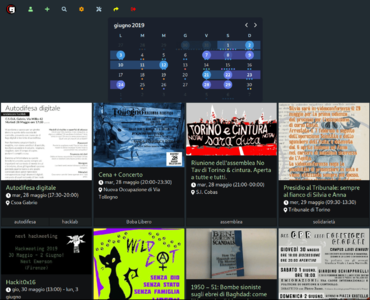
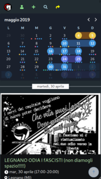

#  ancio
{: .fs-9 }

A shared agenda for local communities.
{: .fs-6 }

[Get started now](install){: .btn .btn-primary .fs-5 .mb-4 .mb-md-0 .mr-2 } [Demo](https://demo.gancio.org){: .btn .btn-green .fs-5 .mb-4 .mb-md-0 }
[Source](https://framagit.org/les/gancio){: .btn .fs-5 }

{: data-fancybox="group" data-caption="Home of the first gancio instance"}
{: data-fancybox="group" data-caption="Home mobile"}
{: data-fancybox="group" data-caption="Home mobile"}
{: data-fancybox="group" data-caption="Admin interface"}

## Some relevant key features:

- **Focus on content** not on people:
nowhere on gancio appears the identity of who published the event, not even under a nickname, not even to administrators (except in the db). This is not an ego-friendly platform.

- **Visitors first**. We do not want logged user to get more features than random visitor. We do not want users to register, except to publish events and even in this case you can publish an anonymous event.

- **Anonymous events**: optionally a visitor can create events without being registered (an administrator has to confirm them)

- **We are not interested in making hits** so we export events in many ways, via RSS feeds, via global or individual ics, incorporating lists of events or single event via iframe on other websites and via [AP](/federation)

- Very easy UI
- Multidays events support (festival, conferences...)
- Recurrent events support (each monday, each two monday, each monday and friday, each two saturday, etc.)
- Filters events for tags or places
- RSS and ICS export (with filters)
- embeddable iframe ([example](https://gancio.cisti.org/embed/list?title=Upcoming events))
- boost / bookmark / comment events from the fediverse!
- Lot of configurations available (user registration open/close, enable federation, enable recurrent events)

### License

Gancio is distributed by an [AGPL-3.0 Licence](https://www.gnu.org/licenses/agpl-3.0.en.html).
